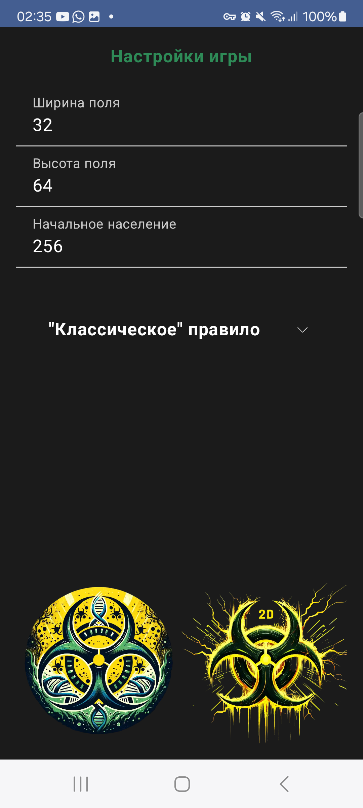
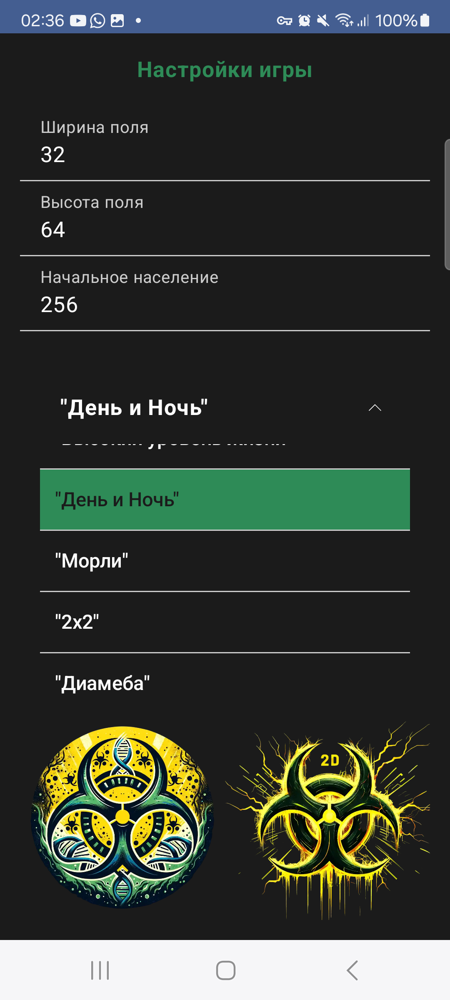
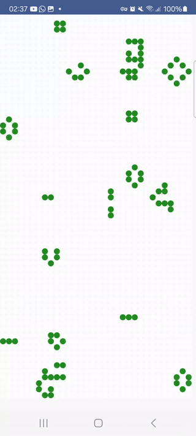
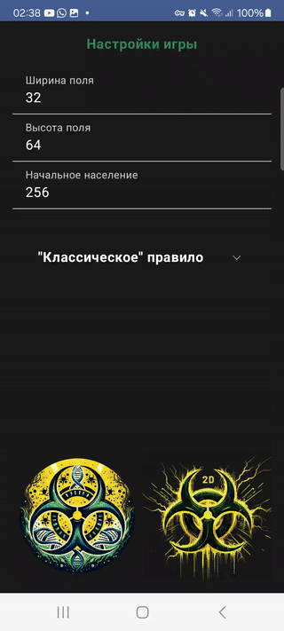

# Игра Жизнь
|  |  |
|:---------------------------------------:|:-----------------------------------:|
| Стартовый экран                         | Меню правил                         |

**Игра Жизнь** — это реализация [знаменитого](https://ru.wikipedia.org/wiki/%D0%98%D0%B3%D1%80%D0%B0_%C2%AB%D0%96%D0%B8%D0%B7%D0%BD%D1%8C%C2%BB) клеточного автомата Джона Конвея на языке Kotlin. Проект включает две версии игры: одну с использованием **OpenGL** для работы с графикой низкого уровня, и другую с использованием **Jetpack Compose**. В этой игре поддерживаются различные модификации правил, что позволяет варьировать поведение клеток и экспериментировать с их эволюцией.

## Особенности
- **Две версии игры**:
    - **OpenGL**
    - **Jetpack Compose**:

|  |  |
|:-----------------------------------------------------------------------------------:|:-----------------------------------------------------------------------------:|
|                                   Compose version                                   |                                OpenGL version                                 |

  
- **Поддержка различных правил** для изменения логики поведения клеток.
- **Высокая производительность** благодаря оптимальной работе с игровым полем через представление его в виде битовых последовательностей.

## Игровое поле

Игровое поле представлено классом `GameBoard`. В основе его работы лежит `CellMatrix` — список целых чисел (`Long`), где каждый бит представляет состояние клетки: живая или мёртвая.

### Основные функции `GameBoard`

- **Инициализация поля**: клетки случайным образом заполняются исходя из начальных настроек игры.
- **Обновление состояния клеток**: для каждой клетки проверяется количество соседей, и на основе заданного правила определяется, останется ли клетка живой или умрет.
- **Подсчет соседей**: для каждой клетки можно подсчитать количество живых соседей, учитывая восемь возможных направлений.
- **Оптимизация**: управление состояниями клеток на основе битовых операций, что позволяет работать с большим количеством клеток эффективно.


### Пример работы с битами

Для управления состоянием клеток используются битовые операции. 

## Правила игры

Правила игры определяют, будет ли клетка живой или мертвой в следующем поколении, в зависимости от её текущего состояния и числа живых соседей.]

Некоторые из доступных правил:

- **ClassicRule** — классические правила Конвея.
- **DayAndNightRule** — клетки остаются живыми или возрождаются при 3, 6, 7 или 8 соседях.
- **HighLifeRule** — добавляет возможность возрождения клетки при 6 соседях.
- **ReplicatorRule** — клетки остаются живыми, если у них нечётное количество соседей.
- **MorleyRule** — клетки остаются живыми при 2, 4 или 5 соседях, а возрождаются при 3 или 6 соседях.
- **TwoByTwoRule** — клетки остаются живыми при 1, 2 или 5 соседях, а возрождаются при 3 или 6 соседях.
- **DiamoebaRule** — клетки остаются живыми при 5-8 соседях, а возрождаются при 3, 5, 6 или 7 соседях.
- **LifeWithoutDeathRule** — клетки остаются живыми навсегда или возрождаются при 3 соседях.
- **SeedsRule** — клетки могут возродиться только при 2 соседях, но никогда не остаются живыми на следующем ходу.

## Установка
1. Вы можете скачать последнюю релизную версию по этой [ссылке](https://github.com/i-redbyte/life-game/releases).

2.1. Склонируйте репозиторий:

   ```bash
   git clone https://github.com/i-redbyte/life-game.git
   ```

2.2. Откройте проект в Android Studio и синхронизируйте зависимости.

2.3. Запустите приложение на эмуляторе или физическом устройстве.

## Вклад в проект

Вы можете предлагать улучшения, исправления или добавлять новые правила, создавая pull request или открывая issue.

## Лицензия

Этот проект распространяется по лицензии MIT. Подробности смотрите в файле [LICENSE](LICENSE).
